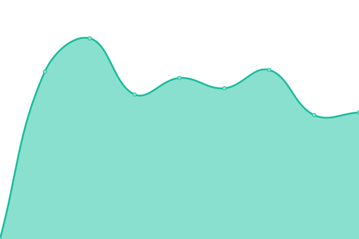

# [📈 Live Status](https://xosan4ever.github.io/upptime): <!--live status--> **🟧 Partial outage**

This repository contains the open-source uptime monitor and status page for [xosan4ever](https://xosan4ever.github.io/upptime), powered by [Upptime](https://github.com/upptime/upptime).

With [Upptime](https://upptime.js.org), you can get your own unlimited and free uptime monitor and status page, powered entirely by a GitHub repository. We use [Issues](https://github.com/xosan4ever/upptime/issues) as incident reports, [Actions](https://github.com/xosan4ever/upptime/actions) as uptime monitors, and [Pages](https://xosan4ever.github.io/upptime) for the status page.

<!--start: status pages-->
<!-- This summary is generated by Upptime (https://github.com/upptime/upptime) -->
<!-- Do not edit this manually, your changes will be overwritten -->
<!-- prettier-ignore -->
| URL | Status | History | Response Time | Uptime |
| --- | ------ | ------- | ------------- | ------ |
|  [demis.ru](https://www.demis.ru/) | 🟩 Up | [demis-ru.yml](https://github.com/xosan4ever/upptime/commits/HEAD/history/demis-ru.yml) | 

 2078ms
     
 | 

<a href="https://xosan4ever.github.io/upptime/history/demis-ru">100.00%</a>
    

|  [demis-promo.com](https://demis-promo.com/) | 🟥 Down | [demis-promo-com.yml](https://github.com/xosan4ever/upptime/commits/HEAD/history/demis-promo-com.yml) | 

 0ms
     
 | 

<a href="https://xosan4ever.github.io/upptime/history/demis-promo-com">0.00%</a>
    

|  [pishem-otzivi](https://xn----dtbhjczpd6a7cybb.xn--p1ai/) | 🟥 Down | [pishem-otzivi.yml](https://github.com/xosan4ever/upptime/commits/HEAD/history/pishem-otzivi.yml) | 

 0ms
     
 | 

<a href="https://xosan4ever.github.io/upptime/history/pishem-otzivi">0.00%</a>
    

|  [otzivi-tut](https://xn----ctbo1audah2eb.xn--p1ai/) | 🟥 Down | [otzivi-tut.yml](https://github.com/xosan4ever/upptime/commits/HEAD/history/otzivi-tut.yml) | 

 0ms
     
 | 

<a href="https://xosan4ever.github.io/upptime/history/otzivi-tut">0.00%</a>
    

|  [dms-spb](https://dms-spb.ru/) | 🟩 Up | [dms-spb.yml](https://github.com/xosan4ever/upptime/commits/HEAD/history/dms-spb.yml) | 

 1967ms
     
 | 

<a href="https://xosan4ever.github.io/upptime/history/dms-spb">100.00%</a>
    

<!--end: status pages-->

[**Visit our status website →**](https://xosan4ever.github.io/upptime)

## 📄 License

- Code: [MIT](./LICENSE) © [xosan4ever](https://xosan4ever.github.io/upptime)
- Data in the `./history` directory: [Open Database License](https://opendatacommons.org/licenses/odbl/1-0/)
